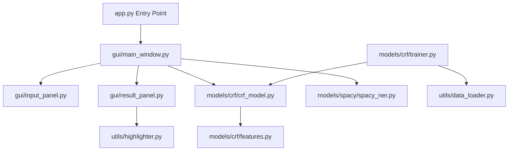

# Comprehensive Technical Documentation

## Project: Comparative Named Entity Recognition (NER) System

**Team Group #2**: Hassan Ali (Lead), Mudassir, Saad Ilyas
**Date**: February 17, 2026

---

## 1. Executive Summary

This project implements a desktop application that compares two distinct approaches to Named Entity Recognition (NER):

1.  **Classical Machine Learning**: A custom-trained **Conditional Random Field (CRF)** model.
2.  **Modern Deep Learning**: A pre-trained transformer-based model from the **spaCy** library (`en_core_web_sm`).

The system is designed to provide users with a side-by-side performance analysis, focusing on accuracy (entities found) and efficiency (processing time).

---

## 2. System Architecture

The application follows a modular architecture to separate the concerns of the User Interface (UI), the Machine Learning logic, and the Data Handling utilities.



---

## 3. Core File Breakdown & Code Explanation

### 3.1 Entry Point: `app.py`

This is the "Start" button of the software. It simply imports the Main Window and starts the application loop.

```python
from gui.main_window import MainWindow

def main():
    app = MainWindow() # Create the window
    app.run()          # Keep it open

if __name__ == "__main__":
    main()
```

### 3.2 The Controller: `gui/main_window.py`

This file is the "Brain" of the interface. It connects the buttons on the screen to the AI models in the background.

**Key Logic:**

- **Initialization**: Loads both the CRF and spaCy models into memory when the app starts.
- **`button_click()`**: This is the most important function. It retrieves text from the input box, checks which model the user selected, and calls the appropriate processing logic.

```python
def button_click(self):
    txt = self.in_p.get_text() # Get user input
    ml = self.in_p.get_model_choice() # Get dropdown selection

    if ml == "spaCy Model":
        results = self.spacy_m.process(txt) # Direct call to spaCy
    elif ml == "CRF Model":
        words = re.findall(r"[\w']+|[^\w\s]", txt) # Tokenize text
        feats = [extract_features(words, i) for i in range(len(words))] # Extract features
        preds = self.crf.predict([feats])[0] # AI Predicts labels
```

---

### 3.3 CRF Model Logic (Hassan's Core Work)

The CRF model doesn't just look at the word; it looks at the "context" and "shape" of the word.

#### `models/crf/features.py` (The Feature Engineer)

This file tells the AI what to look for. We convert every word into a dictionary of properties.

**Important Features Explained:**

- **Word Shape**: Converts "Google" to "Xxxxx" and "1995" to "dddd". This helps the AI recognize patterns in capitalization and numbers.
- **Context Window**: We look at the word _before_ and the word _after_. If the word before is "Mr.", the current word is likely a `PERSON`.

```python
def extract_features(sentence, index):
    word = sentence[index]
    features = {
        "word.lower()": word.lower(),
        "word.istitle()": word.istitle(), # Checks if first letter is Capital
        "word.isdigit()": word.isdigit(), # Checks if it's a number
        "word_shape": word_shape(word),   # E.g., 'U.S.' -> 'X.X.'
    }
    # Context Logic
    if index > 0:
        prev_word = sentence[index - 1]
        features["-1:word.lower()"] = prev_word.lower()
    return features
```

#### `models/crf/crf_model.py` (Model Wrapper)

This file uses the `sklearn-crfsuite` library. It provides a simple `predict()` method that takes the features we extracted and returns the predicted labels (like `B-PER`, `I-ORG`, etc.).

---

### 3.4 spaCy Integration (Mudassir's Core Work)

#### `models/spacy/spacy_ner.py`

We use spaCy's pre-trained neural network. This is easier to implement but harder to explain "internally" as it is a "Black Box" model.

```python
def process(self, text):
    doc = self.nlp(text) # The neural network processes the text here
    entities = []
    for ent in doc.ents:
        entities.append({
            "text": ent.text,
            "label": ent.label_, # E.g., PERSON, GPE, ORG
        })
    return {"entities": entities}
```

---

### 3.5 GUI Components (Saad's Core Work)

#### `gui/input_panel.py`

Manages the left side of the app. It uses `tk.Text` for the large input box and `tk.OptionMenu` for selecting models.

#### `gui/result_panel.py`

Manages the right side. It formats the entity list into a readable table format inside a read-only text box.

#### `utils/highlighter.py`

This is a utility that adds colors to the text. For example, it highlights `PERSON` in light blue and `ORG` in light purple inside the input box.

---

### 3.6 Data & Training

#### `utils/data_loader.py`

This file reads the **CoNLL2003** dataset. The dataset is in a specific format (one word per line with its tag). This script parses those lines into sentences that the CRF can learn from.

#### `models/crf/trainer.py`

This is the script used _before_ the presentation to create the `crf_model.joblib` file. It:

1. Loads training data.
2. Extracts features for millions of words.
3. Trains the CRF algorithm.
4. Saves the resulting "Brain" to a file.

---

## 4. Presentation Script Snippets (For the Team)

> [!TIP]
> Use these snippets to explain your part of the project to the examiner!

### For Hassan (Lead / CRF Developer)

"I focused on the **CRF (Conditional Random Field)** model. Unlike standard neural networks, CRF is a statistical model that is great for sequence labeling. I hand-engineered over 20 features in `features.py` (like suffixes, word shapes, and context windows) to help the model understand the nuances of the English language. I trained this model on the professional CoNLL2003 dataset."

### For Mudassir (spaCy Integration)

"I implemented the **spaCy** model integration. We used the `en_core_web_sm` model, which is a modern neural network pipeline. My role was to create a clean wrapper around the spaCy library, allowing our GUI to send raw text and receive a structured list of entities with their start and end positions."

### For Saad (GUI Designer)

"I designed and built the **Tkinter-based GUI**. I focused on creating a 'Responsive Layout' where the input panel takes 70% of the space and results take 30%. I also implemented the scrolling logic and integrated Hassan and Mudassir's backend modules into the 'RUN' button logic to ensure a seamless user experience."

---

_Last Updated: February 17, 2026_
